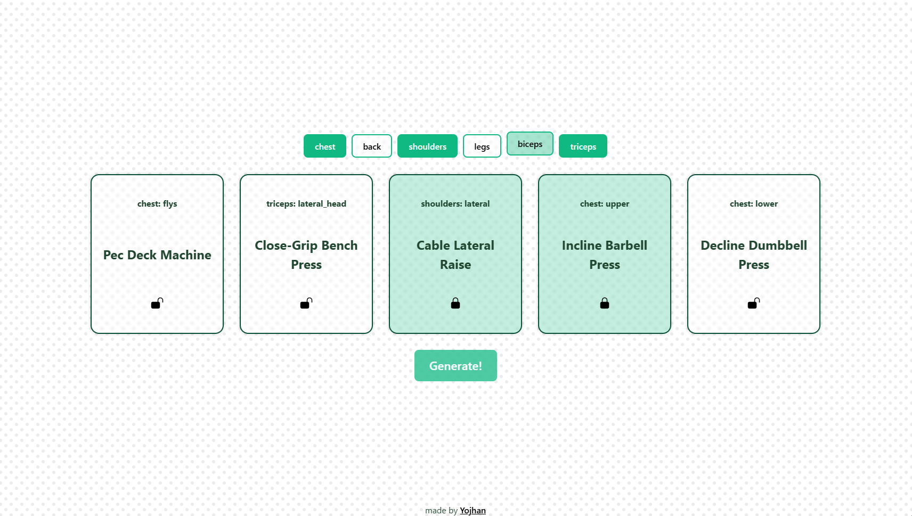

# 🏋️‍♂️ Work It Out

A fast and minimalistic workout routine generator built with React — pick your muscle groups and get an instant training plan.  
[🎮 Live Demo](https://sryojhan.github.io/work-it-out/)

---

## 🎯 Goal

Work It Out is designed to help users quickly generate effective workout routines by selecting targeted muscle groups. It aims to provide a clean, user-friendly interface for casual gym-goers or beginners looking for structured plans without overcomplication.

---

## ⚙️ How it Works

Users select one or more muscle groups from the interface. The app generates a routine by randomly selecting exercises from a local JSON database, organized by group and sub-section (e.g., chest → upper, lower, flys). The algorithm favors underrepresented subgroups to create balanced sessions.

Everything runs client-side with no backend — transitions are instant and the app loads in milliseconds thanks to Vite and its lightweight structure.

---

## ✨ Features

- 🧠 Smart randomization with subgroup balancing
- 🎯 Muscle-group-based filtering
- 🧼 Minimal and distraction-free UI
- ⚡ Instant routine regeneration with one click
- 🚀 Loads instantly and works offline-ready out of the box
- 🧩 Built entirely with React + Tailwind for speed and responsiveness

---

## 📸 Media

 <!-- Replace with actual image/GIF when available -->

---

## 🧰 Technologies Used

- React + Vite
- JavaScript (ES6) with JSDoc
- Css
- Local JSON-based exercise data

---

## 🛣️ Roadmap

Planned features for future releases:

- 🤖 Smarter selection algorithm that avoids repetitive patterns
- 🖼️ Additional info per exercise: images, difficulty, instructions
- 💾 Save and revisit previously generated routines
- 🧠 Basic learning from previous sessions (e.g., history-aware selection)
- 🌐 Progressive Web App (PWA) support for offline access
- 🔍 Filter by equipment availability or goal (e.g., hypertrophy, cardio)
- 🌍 Internationalization: ES/EN language toggle

---

## 👤 Author

**Yojhan Steven García Peña**  
[🌐 Portfolio](https://sryojhan.github.io/) • [🐙 GitHub](https://github.com/sryojhan) • [🎮 Itch.io](https://yojhan.itch.io/) • [✉️ Email](mailto:imyojhan@gmail.com)
